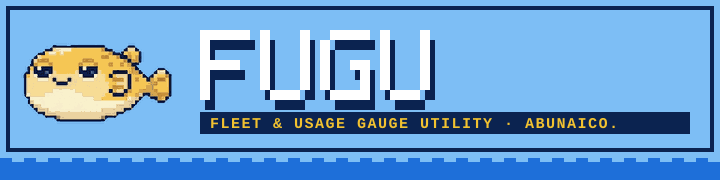

<p align="center">
  
</p>

# FUGU: Fleet & Usage Gauge Utility


**Harness chrome for Claude Code.**
Simple as Grokbot. Powerful as Hermes. Meme as OpenClaw. The *abunai* fish:
prepared wrong, it kills. So FUGU watches your gauges, and it inflates as your context fills.

Fugu is Japanese for pufferfish, and abunai means dangerous, which is the point: a session
left alone burns money quietly, so this one sits in your statusline, counts every token you
spend, and tells you which habit cost what, with the receipts to back it.

```
🐡 Opus 5.5 [high · Explanatory] · 👤 you@example.com (max)
██░░░░░░░░ 17% 5h 62% ⏰1h30m →88% 7d 41% ⏰3d0h →71% cache 52m · $4.12
📁 fugu · main ✔
```

FUGU is a Claude Code plugin. It doesn't wrap, patch, or proxy the `claude` binary. Everything
runs inside the unmodified CLI under your own login, reading files Claude Code already writes to
your disk. No OAuth token handling, no credential intermediation, no network calls. Just chrome.

## What you get

| Piece | What it does |
|---|---|
| **HUD** (`statusline.sh`) | Three-line statusline. Line 1: model, effort level and output style, the Anthropic account this session bills to. Line 2: color-coded context bar; 5h/7d rate-limit meters with reset countdown (⏰) and where you'll land at the current pace (→); how long until the prompt cache goes cold; session cost. Line 3: directory and git branch/dirty flag. The fish puffs up; the toxin ☠️ comes out at 90% context. |
| **Context + cache viewer** (`bin/fugu-context`) | What is filling the context window, how well the prompt cache is holding, and why it broke when it did. Per-turn usage, hit rate, cache breaks with a likely cause, largest context items, subagent usage. |
| **Accounts** (`bin/fugu-accounts`) | Every Claude Code login on the machine (default config plus profile dirs) with its last-known 5h/7d usage and reset times, side by side. Tells you which account has room without touching a single token. |
| **Fleet dashboard** (`subagent-statusline.sh`) | Every running subagent as `⚡ finder [opus-5] ▸ running · 42k 21%`. Fits the terminal: model, context %, tokens, and status drop in that order, then the name is clipped with `…`. Applied automatically while the plugin is enabled. |
| **Session radar** (`bin/fugu-sessions`) | Cross-project index and manager for every Claude Code session on the machine: age, cost, project, resume command. Name, star, archive, or assign a session to a project. Save transcripts before Claude Code's 30-day cleanup deletes them, and restore them later. Incremental byte-range indexing, so only new bytes are ever re-read. |
| **Burn report** (`bin/fugu-burn`) | Where the tokens went: ranked insights with a monthly saving, cost by account, project, session name, agent, work type, and model, a practices check (big models doing execution, mid-work compactions, cache restores after idle, CLAUDE.md load, files re-read), value proxies (commits and PRs per dollar, git lines), and a before/after comparison for a habit change. Claude Code and Codex sessions. `--html` writes one self-contained file to share. |
| **Panels** (`panel/`, `vscode-ext/`, `bin/fugu-dash`) | The same dashboard in three places: a VS Code extension (🐡 status bar, sidebar view, editor tab) for people on the Claude Code VS Code extension, which never shows a statusLine; a local browser page; and `fugu-dash` for a Warp or tmux split. Spend, context meter, cost by project, recent sessions, accounts, and insights, including optional Haiku-written patterns. See [Panels](#panels). |
| **Installer** (`bin/fugu-install`) | `npx github:Abunaico/fugu` adds the marketplace, installs the plugin, wires the HUD, and offers the VS Code panel and a Warp side pane. Also `update`, `uninstall`, `status`. |
| **Watch** (`bin/fugu-watch`) | Background monitor. Tells you in-session when *another* session finishes its turn, stops on an error, or goes quiet mid-turn (possible stall). |
| **Help** (`bin/fugu-help`) | Every command, plus FUGU drawn in truecolor ANSI pixels (`--puff` for the puffed one). |
| **Update** (`bin/fugu-update`) | Brings every install scope up to the latest release. |
| **Banner** | SessionStart hook. You'll know it when you see it. |

### Skills

| Skill | Use it for |
|---|---|
| `/fugu:hud` | Check, install, repair, or remove the HUD statusline |
| `/fugu:context` | Context breakdown and cache report for this (or any) session |
| `/fugu:accounts` | Usage across every login on the machine |
| `/fugu:sessions` | Scan, name, star, archive, assign, save, and restore sessions |
| `/fugu:burn` | Cost and practices report; before/after a habit change |
| `/fugu:open` | Resume or fork a session into a new tmux/Warp pane |
| `/fugu:fleet` | Explain or tune the subagent dashboard |
| `/fugu:layout` | List, switch, or make HUD layouts |
| `/fugu:detailed`, `/fugu:compact` | Layout shortcuts |
| `/fugu:settings` | Turn individual features on or off |
| `/fugu:update` | Update every install; `check` only compares versions |
| `/fugu:off`, `/fugu:on` | Mute or unmute everything without uninstalling |
| `/fugu:help` | List every fugu command; `fugu-help` in a terminal draws FUGU in full color (`--puff` for the puffed one) |

## Install

One command, from any terminal (needs `node` 18+ and Claude Code):

```bash
npx github:Abunaico/fugu
```

It runs the same steps as below through the `claude plugin` CLI: adds the `fugu-tools`
marketplace, installs `fugu@fugu-tools` (user scope), points your statusLine at the HUD, then asks
whether to add the VS Code panel and a Warp side pane. Flags: `--scope project`, `--vscode`,
`--warp`, `--no-hud`, `--yes`, `--dry-run`. Later: `npx github:Abunaico/fugu update`,
`... uninstall`, `... status`.

Or inside Claude Code:

```
/plugin marketplace add Abunaico/fugu
/plugin install fugu@fugu-tools
```

Then start a new session and run:

```
/fugu:hud install   # points your statusLine at fugu's launcher (timestamped settings backup)
/fugu:sessions      # scan the radar
/fugu:context       # see what's in your context
```

To try it for one session without installing, clone the repo and load it directly:

```bash
git clone https://github.com/Abunaico/fugu.git
claude --plugin-dir ./fugu
```

Updates reach the HUD on their own. Claude Code only lets a plugin ship the subagent row
renderer, so the main statusLine is a user setting holding a path. `/fugu:hud` points it at a
small launcher, `~/.fugu/bin/statusline`, rather than at a plugin copy. Each session start records
which fugu copy Claude Code loaded, and the launcher runs that one. After `/plugin update`, the
next session is on the new version with no reinstall. `/fugu:hud` with no argument reports
what's wired, which copy is live, and any leftover copies. The fleet dashboard needs no setup.

**Uninstall:** `npx github:Abunaico/fugu uninstall` removes the plugin, marketplace, HUD
statusLine, VS Code panel, and Warp pane, and asks first. By hand: `/fugu:hud remove` (it only
removes a statusLine that is fugu's), then remove the plugin. Caches live in `~/.cache/fugu` and
`~/.fugu`; neither route deletes them.

## Building FUGU with FUGU

FUGU was built in Claude Code sessions with FUGU running, so its own build makes a good tour.

**Watch the gauges while you work.** The default `compact` layout packs everything into three
lines. Partway through one build session it read:

```
🐡 Opus 5.5 · 👤 you@example.com (enterprise)
███░░░░░░░ 36% 5h 38% ⏰1h30m →54% 7d 41% ⏰3d0h →71% · $55.60 /compact before a break
📁 ~/fugu
```

`/fugu:detailed` spells the same gauges out in words, one per line; `/fugu:compact` switches back:

```
🐡 Opus 5.5 · 👤 you@example.com (enterprise)
context      ███░░░░░░░ 36% full · 368k of 1.0M tokens
5-hour limit 38% used · resets in 1h30m (11:35 AM) · on pace for 54% by reset
weekly limit 41% used · resets in 3d0h (Sat 10:05 AM) · on pace for 71% by reset
prompt cache · /compact before a break
cost         $55.60 this session
📁 ~/fugu
```

The nudge on the cost line appears once the context passes 150k tokens: compact before you walk
away, not mid-work.

**Run a report on the project.** `fugu-burn --project fugu --git` priced that session:

```
🐡 fugu burn: 2026-09-01 → 2026-10-07 · fugu · 1 sessions · $55.60 ≈ API list price

INSIGHTS                                                    saving / month
  1. Keep sessions shorter                                  ≈$646
     The average request re-reads 368k tokens of context; cache reads are 65% of spend.
  2. Run execution on Sonnet                                ≈$240
     $44.95 of your own edit and shell turns ran on Opus or Fable; the same tokens on Sonnet 5 cost $36.95.

BY PROJECT                             spend  share  sessions  opus-exec  restores  commits   +lines  $/commit
  Abunaico/fugu                         $55.60   100%         1        91%     $0.00       36      11k     $1.54

BY WORK TYPE                                        spend  share  requests
  Shell commands                                     $44.05    79%       385
  Conversation (no tools)                             $5.03     9%        52
  Editing code                                        $2.72     5%        19
```

The lesson was plain: one long Opus session carried 368k tokens into every request, and most of
the spend was shell work (tests, screenshots) that Sonnet could run. Splitting the work into
shorter sessions and running execution on Sonnet are the two biggest levers it found.

**Fix the names with a plain-English rule.** Some of the build's folders were called `abunai` and
others `abunaico`. One rule merges them in every report from then on:

```bash
fugu-burn --add-rule "abunai is the same as abunaico. just represent as abunaico."
```

The report header then says `customized: 3 edits from ~/.fugu/report-prompt.md`, and the HTML
report shows the rule and its edits in a Report rules box at the top.

**Share it.** `fugu-burn --account infernored --since-change 2026-09-24 --html ~/reports/` writes
`fugu-burn-infernored-2026-09-10_2026-10-07.html`: one account's before and after, ready to send.
Without `--account` the file is named `all-accounts`.

## Context + cache viewer

```bash
fugu-context                        # this session
fugu-context <session-id>           # any session
fugu-context --project myrepo       # newest session in a project
fugu-context --turns 30 --top 15    # more history, more items
fugu-context --json                 # machine-readable
```

```
CONTEXT
  █████████████████████████░░░░░ 166k / 200k  83%
  autocompact at 80% · threshold passed

  hooks & attachments      ≈   74k  44% ████████████████
  system prompt + tools        63k  38% ██████████████░░
  result: Bash             ≈   16k  10% ███░░░░░░░░░░░░░
  ...

CACHE
  hit rate 96% over 29 requests · input billed at 17% of uncached
  read 3.85M · write 140k (5m 0 / 1h 140k) · uncached 58 · output 27k

  cache breaks (1)
  14:02  rewrote   90k  cold start
```

What's measured and what's estimated:

- **Measured:** every usage number, the hit rate, the per-turn table, and cache breaks. These come
  straight from the API usage Claude Code records in the session transcript (deduplicated per
  request, since one streamed response is logged as several lines).
- **Estimated (`≈`):** the per-category breakdown and largest items. Content is sized by character
  count, then scaled so the categories add up to the measured window. "System prompt + tools" is
  the first request's measured size minus the first prompt.
- **Cache breaks** are requests that rewrote a large part of the prefix instead of reading it. The
  cause is inferred: idle past the cache TTL (5m or 1h), a compaction, a model switch, or a changed
  prefix (tools, MCP servers, or system prompt changed mid-session).
- **"Input billed at X% of uncached"** applies the standard cache multipliers (read 0.1×, 5m write
  1.25×, 1h write 2×) to your actual token mix. It's model-agnostic; no price table involved.
- **Window size** is recorded by the HUD on each render, since transcripts don't carry it. Without
  the HUD it's assumed (200k, or 1M if the session ever went past 200k). Override with `--window`.

## HUD gauges

- **`5h 62% ⏰1h30m →88%`**: 62% used, the window resets in 1h30m, and at the current pace
  you'll end the window around 88%. The projection is linear and stays hidden for the first
  10% of a window, where it's noise. It turns yellow at 85% and red at 100%.
- **`cache 52m`**: time until the prompt cache expires. Every request refreshes it. `cold` means
  the next message rewrites the whole context at the cache-write price. It uses Claude Code's own
  `prompt_cache.expires_at` when present; on older versions it falls back to the last cache
  write in the transcript (only the last 256 KB is read).
- **`[high · Explanatory]`**: effort level and output style. The default style isn't shown.
- **Layouts.** What goes on which line is a small YAML file, one per layout. Built-in:
  `compact` (default), `detailed` (one labeled line per gauge, in words), and `all` (every
  widget, like `/status`). Make your own with `fugu-config layout new <name>` and edit
  `~/.fugu/layouts/<name>.yaml`; switch with `/fugu:layout <name>`. Format and the widget
  list: [layouts/README.md](layouts/README.md). `FUGU_LAYOUT=<name>` overrides per terminal.

  ```yaml
  # detailed.yaml
  lines:
    - [fish, model, mode, ·, account, plan]
    - context:      [context-bar, context-full, ·, context-tokens, ·, context-warning]
    - 5-hour limit: [5h-used, ·, 5h-resets, 5h-clock, ·, 5h-pace-words]
    - weekly limit: [7d-used, ·, 7d-resets, 7d-clock, ·, 7d-pace-words]
    - prompt cache: [cache-words, cache-why, ·, nudge]
    - cost:         [cost-words]
    - [dir, ·, git]
  ```
- **Fits the terminal.** Claude Code passes `COLUMNS` and cuts off anything wider, so the HUD
  sheds detail as the terminal narrows instead of losing the end of the line: pace projections
  go first, then reset countdowns, the bar, cost, and cache; on line 1 the output style, plan,
  git, and account. Segments that fit again come back. `FUGU_HUD_WIDTH` overrides the width.

## Panels

The HUD lives in the terminal's statusLine. The Claude Code VS Code extension never runs that
hook, so its users see nothing. The panels render the same data anywhere else. One core
(`panel/core.js`) gathers it from `fugu-burn`, `fugu-sessions`, `fugu-context`, and
`fugu-accounts` (`--json`) and draws three ways:

| Where | How to open it |
|---|---|
| **VS Code** | `npx github:Abunaico/fugu --vscode`, then reload VS Code. 🐡 in the status bar shows context % and today's cost for the open workspace (⚠ at 60%, 🔥 at 80%); click it for the dashboard. The fish in the Activity Bar opens a docked sidebar view. Commands are under **🐡 Fugu:** in the Command Palette. |
| **Browser** | `node panel/server.js` (port 4850, `--port` to change), then open `http://localhost:4850`. `?project=<substr>` picks which session's context to show. Auto-refreshes every 20s. Binds to 127.0.0.1 only. |
| **Terminal** | `fugu-dash` in a split pane (Warp, iTerm, tmux). `r` refresh, `g` regenerate insights, `q` quit; `--project`, `--every <s>`. The installer's `--warp` adds a launch configuration that opens your shell beside it. |

What's on it:

- **Stat tiles**: spend, sessions, and requests today, plus the biggest saving lever.
- **Open sessions**: a context meter for every Claude session touched in the last hour (up to 8),
  with the autocompact mark, a worded status (room to work, filling up, near autocompact), cost, and
  what is filling it. In VS Code, the workspace's own session is pinned first.
- **Cost by project** today, as sorted bars.
- **Insights**: fugu-burn's measured levers (7 days, scaled to a month) and, when
  `model.haiku` is `on`, 3 to 5 patterns Haiku writes from the same summary, naming the projects
  they apply to. Haiku runs at most once an hour while a panel is open, never on the 20s poll,
  plus a Regenerate button. A run takes about a minute and costs a few cents, counted in
  `~/.fugu/spend.json`; the result is cached in `~/.fugu/insights.json`. Haiku's items are
  suggestions; the levers are measurements.
- **Recent sessions** (active ones marked) and **accounts**.

The panels wear the same arcade look as the `fugu-burn --html` report (sky, navy, amber, hard
shadows), with a navy dark mode that follows your system or VS Code theme, and fold to one column
in a narrow sidebar. In VS Code, `fuguStatus.theme: editor` swaps it for your editor's colors. They call fugu's own `bin/` by path, so a GUI-launched VS Code without your shell
PATH still finds them.

## Accounts

```
🐡 fugu accounts — 3 profiles

  ● you@example.com      max   5h ███░░░  45% ⏰2h10m  7d ██░░░░  31% ⏰4d6h   3m ago  default
    you@work.example     team  5h ░░░░░░   4% ⏰4h02m  7d █░░░░░  12% ⏰2d1h   1h ago  work
    side@example.com     pro   5h    —                 7d    —                never seen  side
```

Usage per account is the newest of two readings: what the HUD saw the last time it rendered for
that account, and the utilization Claude Code caches in the profile's `.claude.json`. A window
whose reset time has passed shows 0%. Profiles are found in `~/.claude.json`, `$CLAUDE_CONFIG_DIR`,
`~/.aimux/profiles/*`, `~/.claude-profiles/*`, and `$FUGU_PROFILE_DIRS` (colon-separated). To
work as another account, start Claude Code with that profile: `CLAUDE_CONFIG_DIR=<dir> claude`.
fugu never copies or swaps credentials.

## Burn report

```bash
fugu-burn                             # last 30 days, every project
fugu-burn --days 7 --project swingr
fugu-burn --account infernored          # one login's sessions
fugu-burn --since-change 2026-10-01   # before vs after a habit change
fugu-burn --html report.html          # one self-contained file to share
fugu-burn --html ~/reports/           # a folder: fugu-burn-<account or all-accounts>[-<project>]-<from>_<to>.html
fugu-burn --git                       # add commits and lines changed per repo (--full, and --html, include it)
```

```
PRACTICES
  ▲ Big models doing execution     69% of Edit/Write/Bash calls ran on Opus or Fable
    Opus-High to plan and review, Sonnet-High to execute (infra excepted).
  ▲ Cache restores after idle      248 returns after the cache expired · $825 (9% of spend)
    Coming back after the cache TTL rewrites the whole context. Compact before a long break.
```

- **Insights** rank the biggest levers by a monthly saving computed from your own data: execution
  and subagents on Opus or Fable repriced at Sonnet, cache restores after idle, fixed prompt
  overhead above 30k, average context above 200k, mid-session model switches, and compactions.
  They overlap, so they're not additive.
- **Session names**: the first word of a `/rename` title (`IRT-…`, `ACO-…`) becomes a workstream
  tag, so renaming sessions gives spend by workstream. Every session is listed with its spend.
- **Git** (with `--git`, `--full`, or `--html`): commits and lines changed per project in repos
  your sessions worked in (found from where they edited files), with dollars per commit and per
  1,000 lines. Each repo is queried with a 4 second timeout.
- **The HTML report** is one file with no network: every table sorts by column, and tables over 12
  rows get a filter box; hovering a project, account, tag, agent, work type, model, or session
  shows a card with its spend, model mix, work mix, agents, and top sessions; clicking opens a
  drawer with every session behind it. `--since-change` adds Before and After tabs, each a full
  report. Report rules, if you have any, sit in a box at the top. A pixel FUGU swims along the
  bottom as you scroll: he turns to face the way he swims, rocks with each tail beat, trails
  bubbles when he's going fast, and blinks and pulls faces now and then. Click him to go back to
  the top: he gasps, pops up puffed, floats belly-up paddling in a trickle of bubbles, deflates
  with a spin, and bolts as the page scrolls. The whole
  fish is about 5 KB of PNG, and he sits still if your system asks for reduced motion.
- **What fugu costs** closes every report: the report itself is $0 (no model calls), the skill
  listings fugu adds to each request, and Haiku labels if you opted in.
- **Costs** are estimates at Anthropic API list prices, from the usage each response records
  (streamed lines deduplicated, subagents included). On a subscription they show relative weight,
  not your bill.
- **Cost drivers** split every dollar into cache reads, cache writes (normal growth versus
  returns after idle, session starts, compactions, model switches, and prefix changes), output,
  and uncached input, plus main thread versus subagents, the fixed prompt overhead each request
  carries (system prompt, tools, skills, CLAUDE.md), and requests per prompt.
- **By agent** splits spend between your turns (the main thread) and subagents by type, with
  UCEF specialists (`ucef-*`) grouped and counted by runs. Subagents record their type beside
  their transcript, so this is exact.
- **By work type** files each response under the highest-ranked tool it called: editing code,
  editing docs (`.md`, `.txt`), shell, delegating to agents, reading and searching, other tools,
  conversation with no tools, or rewriting the cache after a compaction. It sums to the total. The
  compaction summary call itself isn't in transcripts, so it's estimated separately from each
  compaction's size and left out of the totals.
- **Practices** each map one habit to one number: execution tool calls by model family, manual
  compactions followed by more work within 15 minutes versus before a break, cache rewrites after
  the TTL expired (priced as the write cost above a cache read), CLAUDE.md and memory tokens times
  requests, files read in three or more sessions, fixed prompt overhead, and the auto-compact threshold.
- **Before/after** compares the period since a date with an equal period before it, as rates per
  day or per unit (spend per commit, per PR) so unequal periods compare fairly. Commits and PRs are
  rough value proxies; judging the work itself stays with people.
- **Accounts** split spend per request by the organization Claude Code records for each
  session (`credential_org`), so a session that switched logins is split correctly and subagents
  follow their parent. Older transcripts that predate that record fall back to a profile's last
  session per project, else show as unknown. Labels come from each profile's `.claude.json`
  (email, plan, org). `--account <words>` narrows every section to sessions mostly on that login; every word must match (`--account "infernored enterprise"`).
- **Projects** come from each session's git root, or its folder when there's no repo. A project
  folder inside another is named `Parent/child` (`Abunaico/fugu`); drive roots and your home folder
  never count as parents. Name a folder in `~/.fugu/projects.json`
  (`{"projects": {"Abunaico": ["/Volumes/Flash4T/Development"]}}`) and everything beneath it nests
  under that name. Fold names together with `fugu-sessions merge` (case-insensitive aliases, full
  nested names too), or move one session with `fugu-sessions assign`.

## Customizing reports

`~/.fugu/report-prompt.md` holds plain-English rules for reports. It ships empty.

```bash
fugu-burn --add-rule "abunai is the same as abunaico; show it as Abunaico"
fugu-burn --rules        # the rules, and the edits they compiled to
fugu-burn --recompile    # compile again without changing the rules
```

The next report sends Haiku the rules and the names it may change (projects and tags, plus
accounts only when a rule mentions them; never transcripts) and gets back a fixed set of edits:
project renames, tag renames, account labels, hidden projects. fugu keeps only edits to names that
exist, applies them in code, and caches them until the rules change, so ordinary runs make no
Haiku call. Your own `~/.fugu/projects.json` always wins. Needs `fugu-config set model.haiku on`.
Reports say `customized: N edits from ~/.fugu/report-prompt.md`; the HTML version lists the rules
(without the file's comment block) and the edits they made.

## Codex

fugu reads OpenAI Codex sessions too (`$CODEX_HOME/sessions`, default `~/.codex`), the same way
Switchboard does: each rollout carries its own folder, subagent threads attach to their parent, and
titles (including Codex's `/rename`) come from `session_index.jsonl`. They show in the radar with a
`cx` marker and `codex resume <id>` (`fugu-sessions --tool codex` lists only them), and in every burn
report section, with a BY TOOL split. Requests come from Codex's cumulative token counts, filed by
work type from the tool calls (`apply_patch`, `exec`, ...).

fugu ships no OpenAI prices, so Codex shows exact tokens and "unpriced" dollars until you add your
own prices in `~/.fugu/prices.json` (exact model name or prefix, $/MTok):

```json
{"models": {"<codex model>": {"input": 0, "cached": 0, "output": 0}}}
```

## Updating

```bash
fugu-update --check   # installed vs latest; changes nothing
fugu-update           # or /fugu:update
```

It fast-forwards a git-clone marketplace (only a clean `main`; any other branch or local change is
left alone and reported), refreshes the marketplace, and runs `claude plugin update` for every
install scope. New sessions load the update.

## Session manager

```bash
fugu-sessions name 745491b4 "Burn report build"
fugu-sessions star 745491b4
fugu-sessions archive 3f2a9c01          # hides it; nothing is deleted
fugu-sessions assign 3f2a9c01 hermes
fugu-sessions merge abunaico --into Abunaico   # fold renamed or duplicate project names
fugu-sessions save                      # starred + anything within 7 days of deletion
fugu-sessions saved                     # what's in ~/.fugu/archive; "pruned" = original gone
fugu-sessions restore 3f2a9c01
```

Claude Code deletes transcripts after `cleanupPeriodDays` (default 30). `save` copies them, with
their subagent transcripts, into `~/.fugu/archive`; fugu never moves or deletes a transcript.

**Haiku names (opt-in, off until you say yes).** `fugu-sessions label` asks Haiku, through
`claude -p` on your own login, for a short name and summary for unlabeled sessions. Only titles
and first-prompt snippets are sent, never transcripts; it runs without tools, MCP servers, or
saved settings, and isn't saved as a session. `/fugu:sessions` asks once. Say "not now" and it
asks again on about one run in ten; say "never" and it never asks. Change it any time with
`fugu-config set model.haiku on|off|never`.

## Settings

Every feature can be switched off on its own. Run `/fugu:settings` for a picker, or use the CLI:

```bash
fugu-config                      # every feature and its state
fugu-config off hud.cost hud.git # hide segments
fugu-config on hud.cost
fugu-config reset                # everything back on
```

| Key | Controls |
|---|---|
| `hud.fish` | the pufferfish (and the skull at 90%) |
| `hud.mode` | effort level and output style |
| `hud.git` | git branch and dirty flag |
| `hud.account` | active Anthropic account |
| `hud.rate` | 5h/7d rate-limit meters |
| `hud.reset` | reset countdown on the meters |
| `hud.pace` | pace projection on the meters |
| `hud.cache` | prompt-cache countdown |
| `hud.cost` | session cost |
| `hud.nudge` | "/compact before a break" hint once the context passes 150k tokens (yellow under 10 minutes of cache) |
| `fleet` | subagent fleet rows |
| `banner` | session start banner |
| `watch` | cross-session watch notifications |
| `autoname` | auto-name sessions from their first prompts (Haiku) |

State lives in `~/.fugu/config` as `key=off` lines (anything not listed is on), so you can
also edit it by hand. `model.haiku` is a choice (`ask`, `on`, `off`, `never`) set with
`fugu-config set`; `reset` leaves it alone, so "never" stays never. The panels' Haiku insights
run only when it is `on`. The HUD parses it in pure bash, so a switched-off feature costs nothing and
also skips its work (no git refresh, no transcript read). Changes apply on the next render.

## Knobs

- `FUGU_MOOD=off` deflates the fish (why would you). Same as `fugu-config off hud.fish`.
- `/fugu:off` and `/fugu:on` toggle a marker file (`~/.fugu/disabled`) that the HUD, fleet
  dashboard, banner, and watcher all check on every run. A live `fugu-watch` goes quiet within
  one poll, no restart needed.
- The HUD never runs git inline. Git status is cached for 5s per directory and refreshed by a
  detached background job, so a hung network mount can't stall the render.
- The account segment follows `CLAUDE_CONFIG_DIR`, so each profile shows its own login. If
  `ANTHROPIC_API_KEY` is set it shows `API key` instead (the key itself is never printed).
- `fugu-sessions --project <substr> --limit N --json --active --search <text> --starred --archived --reindex`.
  The cache lives at `~/.fugu/sessions-cache.json`: one full scan, then warm scans in tens of
  milliseconds.

## Privacy

FUGU only reads files on your machine that Claude Code already wrote: session transcripts under
`~/.claude/projects` and the account profile in `.claude.json` (email, org name, plan type; never
tokens). It writes only to `~/.cache/fugu` (git status, window size, cache TTL tier, and last-seen usage per
account) and `~/.fugu` (settings, the radar index, session metadata, and saved transcripts), all private
to your user, and skips writing if the cache dir isn't owned by you. Two features call Haiku through
your own `claude` login, so their input goes to Anthropic: **autoname** (on by default) sends a
session's first prompts, its folder, and your past session titles to name it
`ACCOUNT-CATEGORY-PROJ-TASK-SUB` (`fugu-config off autoname` turns it off), **Haiku labels**
(off until you say yes) send session titles and first-prompt snippets, and **panel insights**
(only with `model.haiku` set to `on`) send a usage summary: spend by model and project, the
measured levers and practices, and the titles, costs, and message counts of your 15 most recent
sessions, never transcripts. Nothing else leaves your machine. The browser panel listens on
127.0.0.1 only. Text that comes from transcripts,
repos, or config (titles, paths, branch names, emails, model names) is stripped of terminal control
characters, including C1 and carriage returns, before it reaches your terminal or Claude's context.

## Requirements

`jq`, `node` (18+ for the installer and panels), macOS or Linux, and Claude Code. The VS Code panel
needs VS Code 1.85+. The rate meters need a Pro/Max login and appear
after the first response. The test battery also uses `python3`.

## Development

```bash
bash test/run-tests.sh
```

The battery covers degraded input, terminal-escape injection, the non-blocking render path,
incremental indexing edge cases, the off/on toggle, and the context viewer's usage math. Add a
test with every fix.

## License

Free to use, modify, and remix, commercial or not, with attribution to Anthony Shafer and
[github.com/Abunaico/fugu](https://github.com/Abunaico/fugu). See [LICENSE](LICENSE).

FUGU runs alongside Claude Code; it is not affiliated with or endorsed by Anthropic. Each user
authenticates with their own account. Don't point it at other people's sessions.

<p align="center">
  
</p>
